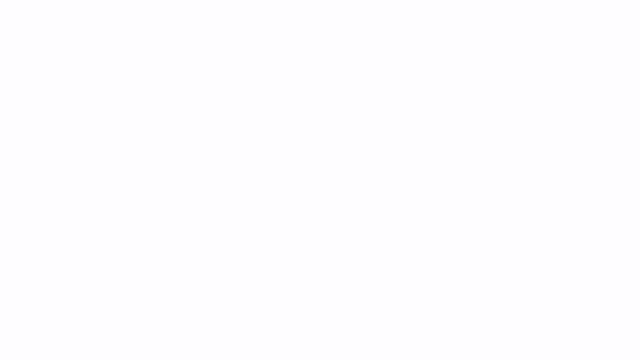
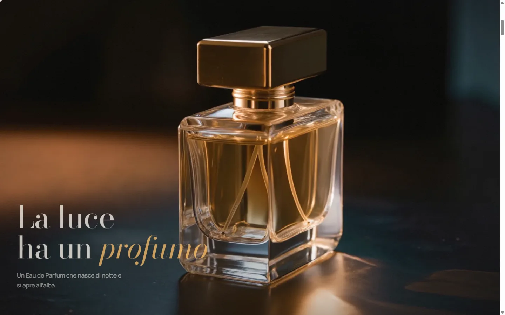
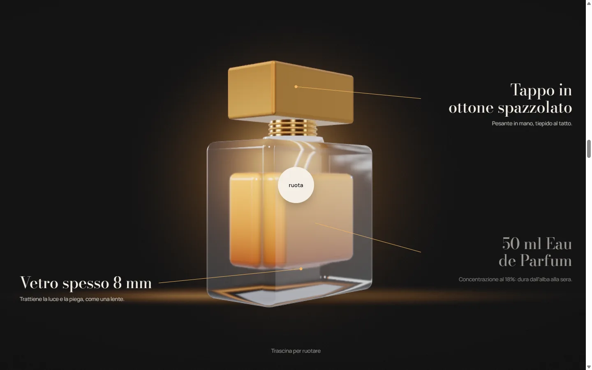
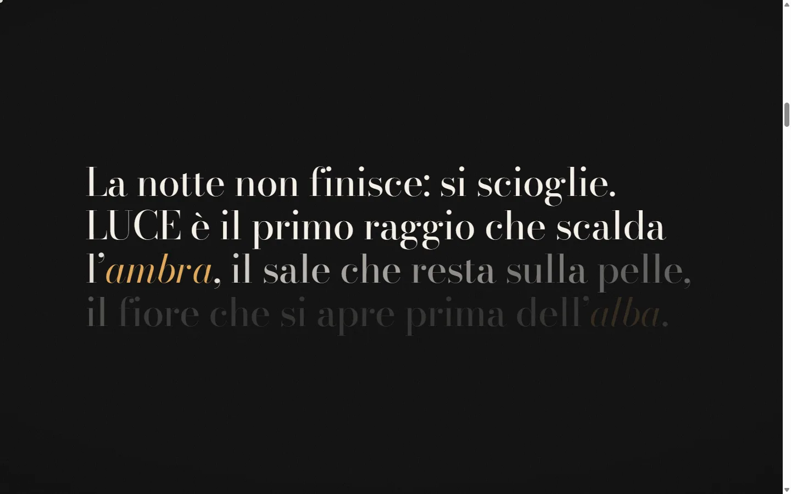
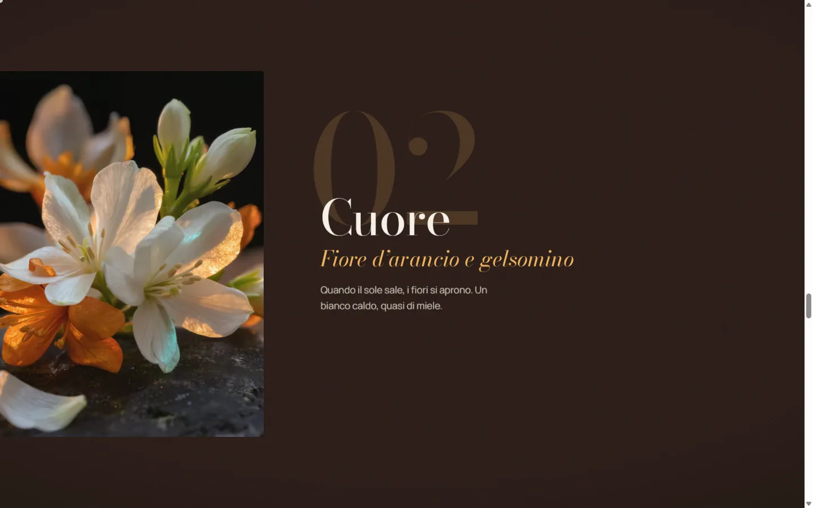
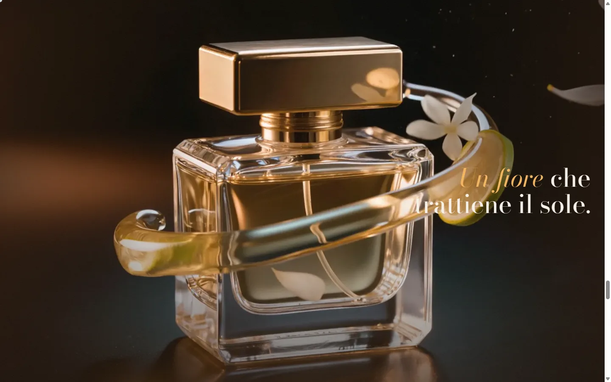
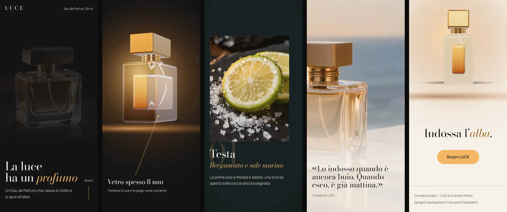

# LUCE — la luce ha un profumo

**Landing scroll-driven per un profumo fittizio**: un video che si "sfoglia" con lo scroll, una bottiglia 3D costruita interamente in codice e una pagina che passa dalla notte all'alba mentre la leggi.

**[→ Sito live](https://francescopierfederici.github.io/luce-3d-landing/)**



> *Concept project: LUCE è un brand fittizio. Nessun marchio, logo o prodotto reale.*

**TL;DR (EN)** — Scroll-driven product landing for a fictional perfume. Canvas image-sequence scrubbing with a bounded bitmap cache, a procedurally modelled glass bottle in Three.js (transmission, IOR, dispersion), a night-to-dawn theme driven by scroll, adaptive WebGL resolution, full `prefers-reduced-motion` support. Vanilla JS + Vite, 60 fps on an integrated GPU, 0 frames over 25 ms on a full scroll. Built with Claude Code as a pair programmer.

---

## Obiettivo

Costruire una landing di prodotto da "Sito del giorno" (livello Awwwards) che mostri due tecniche in un solo racconto:

1. **Video scrubbato allo scroll**: il video non si riproduce, lo guida lo scroll, frame per frame.
2. **3D in tempo reale**: una bottiglia di vetro modellata in codice, con materiali fisici, che ruota con lo scroll e segue il mouse.

Il racconto è *"La luce ha un profumo"*: scrollando si passa dal nero profondo (`#0B0B0C`) all'ambra (`#F2B35B`) fino all'avorio dell'alba (`#F5EFE6`).

## La sfida

Un sito così è facile da far sembrare bello e difficile da far andare **fluido**:

- **Memoria**: 150 frame 1916×1080 decodificati occupano circa **1,2 GB**. Non si possono tenere tutti in memoria.
- **Vetro in WebGL**: con `transmission` il vetro vede solo gli oggetti opachi, quindi il liquido dentro il vetro va trattato a parte. Inoltre è costoso in fill-rate: su una GPU integrata a DPR 2 si scende a 25 fps.
- **Frame persi**: pin, scrub, WebGL e caricamenti pigri tendono a creare scatti proprio nei punti di passaggio tra una sezione e l'altra.
- **Accessibilità**: tutto deve funzionare anche senza animazioni (`prefers-reduced-motion`), senza mouse e su telefono.

## Soluzione tecnica

### 1. Sequenze di frame con budget di memoria — [`FrameSequence.js`](src/components/FrameSequence.js)
- I frame sono estratti con ffmpeg in WebP: 121–151 frame a 1916 px su desktop e metà frame a 960 px su mobile, con un `manifest.json` per sequenza.
- **Due livelli di memoria**: tutti i frame restano come `Blob` compressi (pochi MB); solo **24 `ImageBitmap`** vengono decodificati attorno all'indice corrente, sbilanciati nella direzione dello scroll. Tutto ciò che esce dalla finestra viene liberato con `bitmap.close()`.
- **Download progressivo**: prima i 20 frame critici, che guidano il contatore del preloader, poi un frame ogni 8, ogni 4, ogni 2 e infine il resto. Così lo scrub è completo subito, anche se all'inizio a densità ridotta.
- **`sleep()` / `wake()`**: quando la sezione è lontana le bitmap vengono chiuse, 3 per frame per non bloccare il thread. Misurato: la memoria delle bitmap scende da **211 a 23 MB**.

### 2. Una bottiglia costruita in codice — [`Bottle.js`](src/three/Bottle.js)
- Le proporzioni sono ricavate da una foto di riferimento: corpo in `RoundedBoxGeometry`, pareti spesse 8 mm in scala, ghiera filettata, tappo, pescante curvo.
- **Vetro**: `MeshPhysicalMaterial` con `transmission`, `ior: 1.5`, `dispersion` (disattivata su mobile) e `attenuationColor`.
- **Liquido**: opaco con sfumatura verticale per vertice, perché in three r170 un materiale con transmission non vede un altro materiale con transmission.
- **Fondale dipinto su canvas**: bagliore più una linea d'orizzonte calcolata dalla prospettiva, così il vetro spesso della base rifrange luce e non il vuoto.
- **Ottone spazzolato**: `anisotropy` verticale; HDRI da studio (Poly Haven, CC0).

### 3. Un solo renderer, acceso solo quando serve — [`Stage.js`](src/three/Stage.js)
- Il canvas WebGL è unico, fisso dietro al contenuto e condiviso tra sezione bottiglia e finale. Il render si ferma quando nessuna delle due è in vista.
- **Three.js è caricato in modo pigro** dopo il preloader, con `import()` dinamico: il JS iniziale resta a **57 KB gzip**.
- **Warm-up**: `compileAsync` e un render a canvas invisibile prima che la sezione arrivi, così la prima comparsa non paga la compilazione degli shader.
- **Risoluzione adattiva**: un governor misura i frame e riduce o aumenta il pixel ratio. Scende subito del 12–30% se perde frame e poi non torna a quel livello; su GPU integrate parte già da 1.

### 4. Notte → ambra → alba — [`theme.js`](src/core/theme.js)
- Quattro variabili CSS (`--bg`, `--ink`, `--accent`, `--vignette`) animate con lo scroll in **un'unica timeline**: risalendo si torna esattamente alla notte.
- Grigi e linee derivano da `--ink` con `color-mix()`. L'accento sulla luce diventa `#9A5A12` (contrasto 4,78:1), perché l'ambra su avorio avrebbe solo 1,6:1.
- Header e cursore usano `mix-blend-mode: difference`, così contrastano da soli su qualunque sfondo.

### 5. Scroll e animazioni — [`scroll.js`](src/core/scroll.js)
- Lenis e ScrollTrigger girano su **un solo `requestAnimationFrame`**, il ticker di GSAP. Tutti i movimenti 3D sono smorzati in modo indipendente dal framerate.
- Lo split-text è scritto in casa ([`splitText.js`](src/core/splitText.js)), perché in GSAP 3.12 SplitText non è incluso nel pacchetto npm pubblico. Gli screen reader leggono una copia nascosta visivamente.
- Scroll orizzontale delle note con `containerAnimation`, reveal con `clip-path`, parallax interno.

## Performance (misurate)

Misure con Playwright e Chrome su un portatile con **GPU integrata Intel UHD**, 1440×900, build di produzione.

| Metrica | Risultato |
|---|---|
| fps in uno scroll completo della pagina | **60**, 95° percentile 16,8 ms |
| Frame sopra 25 ms (Long Animation Frames) | **0**, in due prove consecutive |
| JS iniziale / Three.js (pigro) | **57 KB** / 129 KB gzip |
| Bitmap decodificate in memoria | massimo **24** per sequenza |
| Peso totale, cache vuota | ~15 MB desktop, ~4 MB mobile (circa il 95% sono frame, scaricati in background) |
| Lighthouse (sito live, desktop) | _in aggiornamento_ |

I tre scatti residui trovati durante lo sviluppo, tutti eliminati:
- la chiusura di 24 bitmap nello stesso frame (40–60 ms);
- il primo compositing del canvas WebGL;
- il ridisegno di una texture 1024² al cambio di scena.

## Accessibilità

- **`prefers-reduced-motion`**: niente pin né scrub e nessuno smooth scroll. Un solo frame statico per ogni video e i contenuti impilati e leggibili.
- **Touch**: niente cursore custom e niente trascinamento. Su telefoni e tablet in verticale c'è un layout impilato dedicato.
- I testi animati hanno sempre una copia per gli screen reader. Le immagini hanno un testo alternativo descrittivo. Il contrasto è ≥ 4,5:1 sui testi.
- **Content Security Policy** nella build: solo risorse del sito e Google Fonts.

## Stack

| | |
|---|---|
| Build | Vite 6, JavaScript vanilla (niente framework) |
| 3D | Three.js r170: `MeshPhysicalMaterial`, `RoundedBoxGeometry`, `RGBELoader` |
| Animazioni | GSAP 3.12 + ScrollTrigger, Lenis 1.1 |
| Asset | ffmpeg: frame WebP, immagini AVIF + WebP responsive |
| Font | Bodoni Moda + Manrope (Google Fonts, OFL) |
| Deploy | GitHub Actions → GitHub Pages |

## Struttura

```
src/
  main.js                 sequenza di avvio
  core/                   env, scroll (Lenis + ScrollTrigger), tema notte→alba, split-text, utility
  components/             FrameSequence, Preloader, header, cursore
  sections/               una sezione = un modulo (hero, manifesto, bottle, notes, essence, ritual, finale)
  three/                  Stage (renderer), Bottle (geometria e materiali), BottleScene (scena e inquadrature)
  styles/                 token + un CSS per sezione
scripts/                  estrazione frame e ottimizzazione immagini (ffmpeg)
public/                   frame, immagini ottimizzate, HDRI
```

## Avvio in locale

```bash
npm install
npm run dev        # http://localhost:5173
npm run build      # build di produzione in dist/
npm run preview    # anteprima della build (base /luce-3d-landing/)
```

Frame e immagini ottimizzati sono già in `public/`. Gli script `npm run frames` e `npm run images` li rigenerano con ffmpeg a partire dai sorgenti originali in `assets/`, che non sono inclusi nel repo per il peso (circa 56 MB).

## Come è stato costruito: con Claude Code

Il progetto è stato sviluppato con **[Claude Code](https://claude.com/claude-code)** come pair programmer, con un metodo preciso.

- **Brief e vincoli scritti**: [`CLAUDE.md`](CLAUDE.md) fissa stack, regole (60 fps, reduced-motion, niente librerie extra senza approvazione) e un protocollo di verifica.
- **Cinque fasi, ciascuna con piano approvato**: setup e hero → manifesto e 3D → sezioni → rifinitura → deploy. Alla fine di ogni fase: report con misure e una sezione *"cosa non mi convince"*.
- **Verifica automatica a ogni passo**: Playwright a 1440 e 390 px, reduced-motion e tablet; screenshot, console, fps, Long Animation Frames, dump di memoria di Chrome.
- **Direzione umana sulle decisioni che contano**. Qualche esempio:
  - il budget di memoria dei frame, con blob compressi e cache limitata, è stato imposto in fase di piano, invece di decodificare tutto;
  - il font è stato scelto da un confronto A/B/C;
  - privacy e sicurezza sono state controllate prima della pubblicazione;
  - ogni ottimizzazione è stata tenuta solo se confermata dai numeri.

L'AI ha accelerato implementazione e misure; brief, gusto, priorità e controllo qualità sono rimasti una responsabilità umana.

## Screenshot

| | |
|---|---|
|  |  |
|  |  |
|  |  |



## Crediti

- HDRI *studio_small_08* da [Poly Haven](https://polyhaven.com/a/studio_small_08) (CC0).
- Font [Bodoni Moda](https://fonts.google.com/specimen/Bodoni+Moda) e [Manrope](https://fonts.google.com/specimen/Manrope) (SIL Open Font License).
- Immagini e video di prodotto forniti dall'autore per questo concept.

---

Concept project: LUCE è un brand fittizio. Design & development: **Francesco Pierfederici**.
